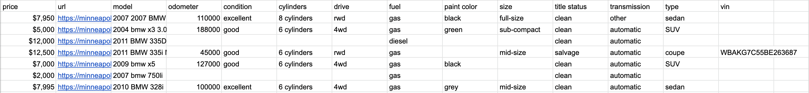
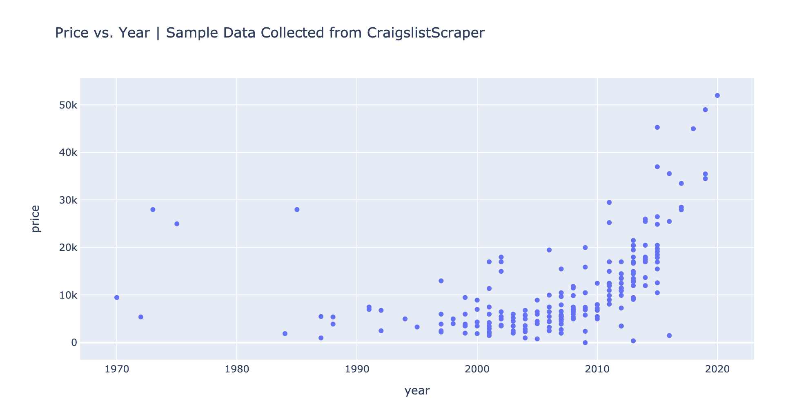
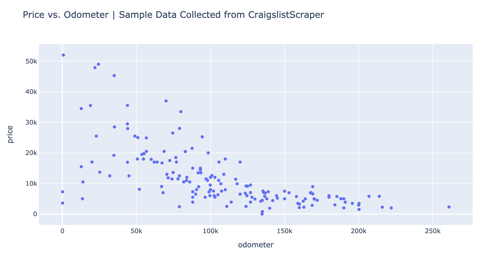

# Ai-NTQ
Automated antique hunting and market value estimation with Ai-powered web crawling. 
Users can define what they would like to search for, then fetch and parse data
from both searches and individual ads and see the estimate market value and 
history of the item in a results spreadsheet. 

* [Usage](#usage)
* [Analyzing](#analyzing)
* [License](#license)

## Usage

Ai-NTQ is built around 6 functions/classes for flexibility. These
functions/classes are listed below. 

For general searches: 
 - Search
 - SearchParser
 - fetch_search

For single ads/posts:
 - Ad
 - AdParser
 - fetch_ad

SearchParser and AdParser are BeautifulSoup-like abstractions for extracting certain
fields from the html data received from Craigslist. Developers may find this useful.

Search and Ad are classes that lazily fetch data from user-defined searches and
ads. To define a search you need at least a query and city, and to define an ad you
need at least a url. Examples are provied below and in the `examples/` folder. 

fetch_search() and fetch_ad() are eager and functional implementations that return a
Search and Ad.

---

Below is a simple example, more examples can be found in the `examples/` folder.

```python
import craigslistscraper as cs
import json

# Define the search. Everything is done lazily, and so the html is not 
# fetched at this step.
search = cs.Search(
    query = "bmw e46",
    city = "minneapolis",
    category = "cto"
)

# Fetch the html from the server. Don't forget to check the status. 
status = search.fetch()
if status != 200:
    raise Exception(f"Unable to fetch search with status <{status}>.")

for ad in search.ads:
    # Fetch additional information about each ad. Check the status again.
    status = ad.fetch()
    if status != 200:
        print(f"Unable to fetch ad '{ad.title}' with status <{status}>.")
        continue

    # There is a to_dict() method for convenience. 
    data = ad.to_dict()

    # json.dumps is merely for pretty printing. 
    print(json.dumps(data, indent = 4))

```


## Analyzing

Data can easily be converted to your json, csv, etc. and used in various
downstream data analysis tasks. OpenAI then automatically estimates the 
fair market value of each antique posted along with historical background 
information from its vast knowledge bank on antiques from anywhere in the world. 

<p>
  
</p>

This data can then be analyzed, some examples include:

<p>
  
</p>

<p>
  
</p>


<!-- LICENSE -->
## License

Distributed under the MIT License. See `LICENSE` for more information.


