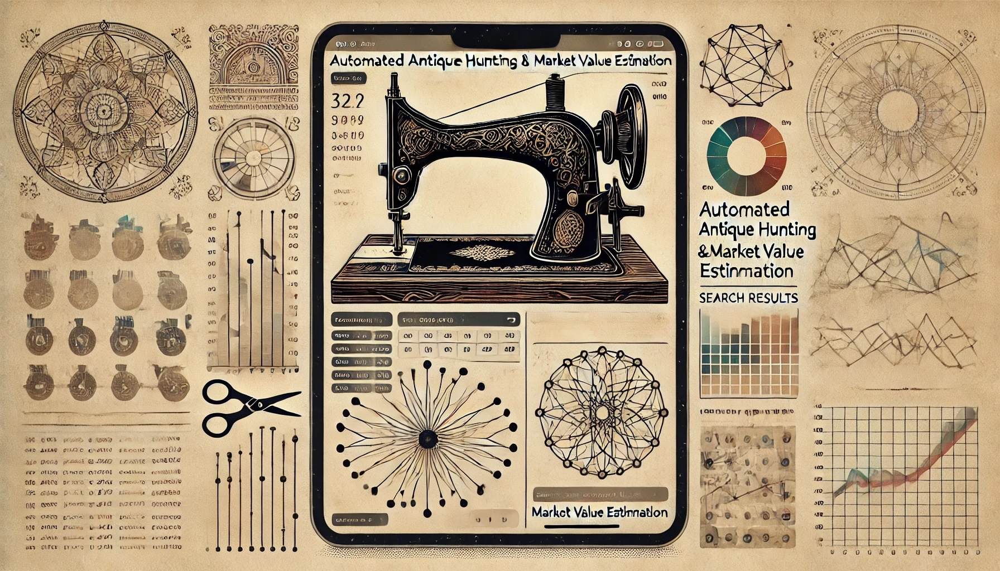

# Ai-NTQ
Automated antique hunting and market value estimation with Ai-powered web crawling. 
Users can define what they would like to search for, then fetch and parse data
from both searches and individual ads and see the estimate market value and 
history of the item in a results spreadsheet. 

  


* [Usage](#usage)
* [Analyzing](#analyzing)
* [License](#license)


## Installation
```
pip install requests beautifulsoup4 selenium pdfkit scrapy scrapyd

```

## Usage
You can use the web cralwers for massive scans, or the CLI tool for individual postings.

### Web Crawler
```
scrapy crawl craigslist_antiques
```

### CLI Tool
Once you save the updated script as craigslist_antiques_cli.py, you can run it from the command line, passing in one or more specific Craigslist URLs:
```
python craigslist_antiques_cli.py https://newyork.craigslist.org/mnh/atq/d/pair-of-antique-kpm-figurines/7769922452.html --api-key YOUR_OPENAI_API_KEY
```
You can also pass multiple URLs:
```
python craigslist_antiques_cli.py https://newyork.craigslist.org/mnh/atq/d/pair-of-antique-kpm-figurines/7769922452.html https://newyork.craigslist.org/mnh/atq/d/another-antique-item/7777777777.html --api-key YOUR_OPENAI_API_KEY
```

#### Notes
- Multiple URLs: The script can handle multiple URLs at once, processing each one individually.
- Error Handling: Consider adding error handling for cases where a URL is invalid, the request fails, or the OpenAI API returns an error.
- Temporary Files: Ensure that the temporary files created during the screenshot and PDF conversion process are properly managed and cleaned up to avoid issues with file handles.

### Development

Ai-NTQ is built around 6 functions/classes for flexibility. These
functions/classes are listed below. 

For general searches: 
 - Search
 - SearchParser
 - fetch_search

For single ads/posts:
 - Ad
 - AdParser
 - fetch_ad

SearchParser and AdParser are BeautifulSoup-like abstractions for extracting certain
fields from the html data received from Craigslist. Developers may find this useful.

Search and Ad are classes that lazily fetch data from user-defined searches and
ads. To define a search you need at least a query and city, and to define an ad you
need at least a url. Examples are provied below and in the `examples/` folder. 

fetch_search() and fetch_ad() are eager and functional implementations that return a
Search and Ad.

---

Below is a simple example, more examples can be found in the `examples/` folder.

```python
import craigslistscraper as cs
import json

# Define the search. Everything is done lazily, and so the html is not 
# fetched at this step.
search = cs.Search(
    query = "bmw e46",
    city = "minneapolis",
    category = "cto"
)

# Fetch the html from the server. Don't forget to check the status. 
status = search.fetch()
if status != 200:
    raise Exception(f"Unable to fetch search with status <{status}>.")

for ad in search.ads:
    # Fetch additional information about each ad. Check the status again.
    status = ad.fetch()
    if status != 200:
        print(f"Unable to fetch ad '{ad.title}' with status <{status}>.")
        continue

    # There is a to_dict() method for convenience. 
    data = ad.to_dict()

    # json.dumps is merely for pretty printing. 
    print(json.dumps(data, indent = 4))

```


## Analyzing

Data can easily be converted to your json, csv, etc. and used in various
downstream data analysis tasks. OpenAI then automatically estimates the 
fair market value of each antique posted along with historical background 
information from its vast knowledge bank on antiques from anywhere in the world. 

<p>
  
</p>

This data can then be analyzed, some examples include:

<p>
  
</p>

<p>
  
</p>

The antiques history and estimated fair market value is returned as JSON:
```
{
  "history": {
    "make": "Singer",
    "model": "C669067",
    "class": "15",
    "manufactured_date": "August 1910",
    "manufactured_location": "Germany",
    "description": "This antique Singer treadle sewing machine features real gold lettering and design, typical of early 20th-century craftsmanship. The treadle machine was a significant advancement in home sewing technology, allowing users to sew without electricity. The Model 15 class was popular for its reliability and was often used both in homes and small tailor shops."
  },
  "fair_market_value": {
    "estimated_value": "$300 - $600",
    "factors": [
      "Condition: Good",
      "Originality: High (gold design intact)",
      "Market demand: Moderate",
      "Comparable sales: Similar models have sold within this range on antique marketplaces."
    ]
  }
}
```

<!-- LICENSE -->
## License

Distributed under the MIT License. See `LICENSE` for more information.


